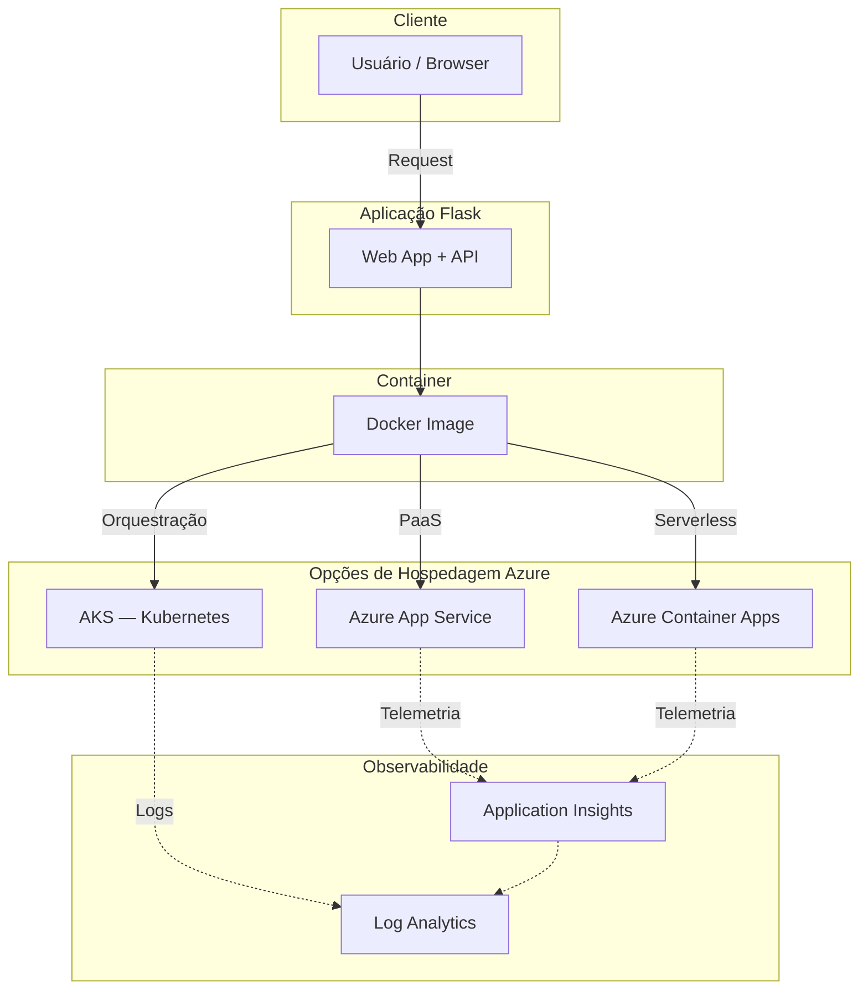
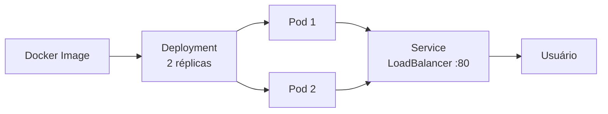

# ☁️ Microsoft Azure Application Platform Lab

**Projeto prático desenvolvido durante a formação [DIO](https://www.dio.me/) — Microsoft Application Platform.**

[](https://azure.microsoft.com/)
[](https://www.docker.com/)
[](https://kubernetes.io/)
[](https://www.python.org/)
[](LICENSE)

---

## Visão Geral

Este repositório documenta o projeto prático de estudo da **Microsoft Azure Application Platform**, cobrindo desde a containerização de uma aplicação web até conceitos de orquestração com Kubernetes, deploy em serviços Azure e observabilidade com Application Insights e Log Analytics.

O objetivo não é apenas entregar o desafio, mas construir um **repositório de portfólio profissional** que demonstre compreensão real dos conceitos, com documentação de qualidade, código funcional e estrutura auditável.

## Desafio

O desafio da DIO solicita:

1. Criar um novo repositório no GitHub.
2. Incluir um `README.md` documentando o processo.
3. Adicionar prints e evidências de execução.
4. Descrever insights e conhecimentos adquiridos.
5. Compartilhar o link do repositório na plataforma DIO.

**Repositório de referência:** [digitalinnovationone/Microsoft_Application_Platform](https://github.com/digitalinnovationone/Microsoft_Application_Platform)

## Objetivos

- Compreender os serviços Azure para hospedagem de aplicações (App Service, Container Apps, AKS).
- Containerizar uma aplicação web com Docker seguindo boas práticas.
- Criar manifests Kubernetes para deploy e exposição de serviços.
- Estudar observabilidade com Application Insights e Log Analytics.
- Aplicar princípios de segurança (sem credentials no código, menor privilégio).
- Documentar aprendizados de forma estruturada e reproduzível.

---

## Arquitetura da Solução

> **Arquitetura conceitual** — representa o design estudado no laboratório.
> Recursos Azure não foram provisionados, salvo quando acompanhados de evidência.



### Trilha Kubernetes (detalhe)



---

## Tecnologias

| Categoria | Tecnologia | Papel |
|---|---|---|
| Linguagem | Python 3.12 | Aplicação web |
| Framework | Flask | API REST mínima |
| WSGI Server | Gunicorn | Servidor de produção |
| Container | Docker | Empacotamento e portabilidade |
| Orquestração | Kubernetes | Deploy, scaling, health checks |
| Cloud | Microsoft Azure | Hospedagem e observabilidade |
| CI | GitHub Actions | Validação automatizada |

---

## Microsoft Azure

Serviços Azure estudados neste laboratório:

| Serviço | Função | Complexidade |
|---|---|---|
| Azure App Service | PaaS para apps web e APIs | Baixa |
| Azure Container Apps | Serverless para containers | Média |
| Azure Kubernetes Service (AKS) | Kubernetes gerenciado | Alta |
| Application Insights | APM e telemetria | Baixa–Média |
| Log Analytics | Centralização de logs (KQL) | Média |

> Detalhamento completo em [`docs/azure-services.md`](docs/azure-services.md)

## Containers

A aplicação é containerizada com Docker seguindo boas práticas:

- Imagem base `python:3.12-slim` (superfície de ataque reduzida).
- Usuário não-root (`appuser`).
- Health check integrado.
- Separação de camadas para cache eficiente.
- Nenhuma credencial na imagem.

```bash
# Build
docker build -f infra/docker/Dockerfile -t azure-app-platform-lab .

# Run
docker run -d -p 8000:8000 --name app-lab azure-app-platform-lab

# Testar
curl http://localhost:8000/health
```

## Kubernetes / AKS

Manifests Kubernetes criados como exemplos didáticos:

- **Deployment** — 2 réplicas, resource limits, liveness/readiness probes.
- **Service** — LoadBalancer expondo porta 80 → 8000.

```bash
kubectl apply -f infra/kubernetes/deployment.yaml
kubectl apply -f infra/kubernetes/service.yaml
kubectl get pods -l app=azure-app-platform-lab
```

## Observabilidade

| Ferramenta | O que coleta | Integração |
|---|---|---|
| Application Insights | Tempo de resposta, erros, dependências, traces | SDK ou auto-instrumentação |
| Log Analytics | Logs centralizados de todos os recursos | Workspace KQL |

A combinação de **métricas + logs + traces** forma os três pilares
da observabilidade moderna. Detalhes em [`docs/architecture.md`](docs/architecture.md).

---

## Estrutura do Repositório

```
azure-application-platform-lab/
├── .github/workflows/
│   └── validate.yml          # CI: lint + Docker build
├── docs/
│   ├── architecture.md       # Arquitetura conceitual + Mermaid
│   ├── azure-services.md     # Tabela de serviços Azure
│   ├── learning-notes.md     # Aprendizados do laboratório
│   ├── security.md           # Diretrizes de segurança
│   ├── AUDIT_HANDOFF.md      # Handoff para auditoria independente
│   └── diagrams/             # Diagramas adicionais
├── evidence/
│   └── README.md             # Checklist de evidências (pendentes)
├── infra/
│   ├── docker/
│   │   └── Dockerfile        # Multi-stage seguro
│   ├── kubernetes/
│   │   ├── deployment.yaml   # Deployment com probes
│   │   └── service.yaml      # Service LoadBalancer
│   └── azure/                # Templates Azure (futuro)
├── src/
│   ├── app.py                # Aplicação Flask
│   ├── requirements.txt      # Dependências Python
│   └── README.md             # Documentação do código
├── .env.example              # Template de variáveis de ambiente
├── .gitignore                # Proteção contra commits sensíveis
├── LICENSE                   # MIT License
└── README.md                 # Este arquivo
```

## Como Executar Localmente

### Pré-requisitos

- Python 3.10+
- Docker
- kubectl (opcional, para Kubernetes local)

### Opção 1 — Python direto

```bash
cd src
pip install -r requirements.txt
python app.py
# Acessar: http://localhost:8000
```

### Opção 2 — Docker

```bash
docker build -f infra/docker/Dockerfile -t azure-app-platform-lab .
docker run -d -p 8000:8000 azure-app-platform-lab
# Acessar: http://localhost:8000
```

### Opção 3 — Kubernetes (minikube / kind)

```bash
# Após build da imagem e load no cluster local:
kubectl apply -f infra/kubernetes/deployment.yaml
kubectl apply -f infra/kubernetes/service.yaml
kubectl port-forward svc/azure-app-platform-lab-svc 8080:80
# Acessar: http://localhost:8080
```

---

## Evidências

> **PENDENTE DE EVIDÊNCIA / EXECUÇÃO PELO AUTOR**
>
> As capturas de tela serão adicionadas à pasta [`evidence/`](evidence/) conforme
> cada etapa for executada. Consulte o [checklist de evidências](evidence/README.md).

## Aprendizados

- **App Service vs Container Apps vs AKS** — cada serviço atende a um nível de complexidade diferente; a escolha depende do cenário.
- **Docker como padrão** — containerizar a aplicação desde o início garante portabilidade e reprodutibilidade.
- **Kubernetes não é sempre necessário** — para aplicações simples, Container Apps ou App Service são mais eficientes.
- **Observabilidade não é opcional** — sem métricas e logs, diagnóstico vira tentativa e erro.
- **Secrets nunca no código** — variáveis de ambiente, GitHub Secrets e Key Vault resolvem.

> Detalhamento completo em [`docs/learning-notes.md`](docs/learning-notes.md)

## Desafios Encontrados

- Definir o escopo correto entre "laboratório didático" e "produção real" sem fabricar evidências.
- Organizar a estrutura de diretórios de forma profissional sem overengineering.
- Escolher uma aplicação de exemplo que fosse útil sem ser trivial demais.

## Melhorias em Relação ao Laboratório Original

| Melhoria | Descrição |
|---|---|
| Documentação estruturada | README premium + docs separados por tema |
| Diagramas Mermaid | Arquitetura visível diretamente no GitHub |
| Aplicação funcional | Código Flask executável com health check |
| Dockerfile seguro | Usuário não-root, health check, slim image |
| Kubernetes com probes | Liveness + readiness + resource limits |
| Documentação de segurança | Audit trail e checklist de boas práticas |
| Separação src/infra/docs | Estrutura profissional de monorepo |
| CI real | GitHub Actions validando lint + Docker build |
| Audit handoff | Documento para auditoria independente |
| Checklist de evidências | Rastreabilidade honesta do que foi executado |

## Segurança

- Nenhuma credencial, token ou secret está versionado neste repositório.
- `.gitignore` bloqueia `.env`, `*.pem`, `*.key`, `credentials.json`.
- Container roda como usuário não-root.
- Detalhes em [`docs/security.md`](docs/security.md).

## Próximos Passos

- [ ] Executar a aplicação localmente e via Docker, coletando evidências.
- [ ] Provisionar Azure App Service ou Container Apps e realizar deploy real.
- [ ] Configurar Application Insights e capturar métricas.
- [ ] Consultar Log Analytics com KQL.
- [ ] Adicionar testes unitários (pytest).
- [ ] Implementar IaC com Bicep ou Terraform.
- [ ] Adicionar container scanning no CI.

---

## Referências

- [Microsoft Azure Documentation](https://learn.microsoft.com/azure/)
- [Azure App Service](https://learn.microsoft.com/azure/app-service/)
- [Azure Container Apps](https://learn.microsoft.com/azure/container-apps/)
- [Azure Kubernetes Service](https://learn.microsoft.com/azure/aks/)
- [Application Insights](https://learn.microsoft.com/azure/azure-monitor/app/app-insights-overview)
- [Docker Documentation](https://docs.docker.com/)
- [Kubernetes Documentation](https://kubernetes.io/docs/)
- [Twelve-Factor App](https://12factor.net/)
- [DIO — Digital Innovation One](https://www.dio.me/)
- [Repositório de referência DIO](https://github.com/digitalinnovationone/Microsoft_Application_Platform)

## Autor

**Matheus Florindo**

- GitHub: [@matheusflorindo32](https://github.com/matheusflorindo32)

> Projeto desenvolvido como parte do desafio educacional da
> [Digital Innovation One (DIO)](https://www.dio.me/), utilizando como referência
> o repositório [Microsoft_Application_Platform](https://github.com/digitalinnovationone/Microsoft_Application_Platform).

## Licença

Este projeto está licenciado sob a [MIT License](LICENSE).

O conteúdo é autoral — nenhum bloco substancial de código foi copiado do repositório de referência.
