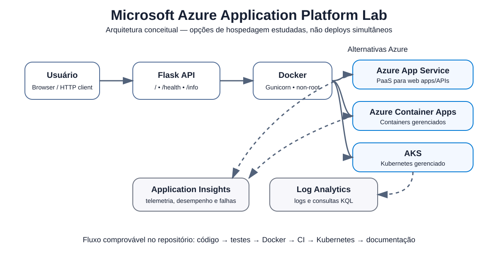

# ☁️ Microsoft Azure Application Platform Lab

**Projeto prático desenvolvido como desafio da DIO — Microsoft Application Platform.**

[](https://github.com/matheusflorindo32/azure-application-platform-lab/actions/workflows/validate.yml)
[](https://azure.microsoft.com/)
[](https://www.docker.com/)
[](https://kubernetes.io/)
[](https://www.python.org/)
[](LICENSE)

## Visão geral

Este repositório transforma os conceitos estudados na formação **Microsoft Application Platform** em um laboratório pequeno, executável e auditável. A implementação usa uma API Flask como carga de trabalho de referência para demonstrar testes automatizados, containerização com Docker, manifests Kubernetes, CI com GitHub Actions, fundamentos de segurança e arquitetura Azure.

O projeto evita declarar infraestrutura cloud que não tenha sido realmente provisionada. App Service, Azure Container Apps, AKS, Application Insights e Log Analytics são documentados como alternativas e conceitos estudados enquanto não houver evidência real de execução.

> **Objetivo:** demonstrar qualidade de engenharia e aprendizado verificável sem ampliar artificialmente o escopo do desafio.

## O desafio da DIO

A entrega proposta pela DIO solicita, em essência:

1. criar um repositório próprio;
2. documentar o processo em `README.md`;
3. incluir prints/evidências;
4. registrar insights e aprendizados;
5. compartilhar o repositório como projeto de portfólio.

**Referência oficial:** [digitalinnovationone/Microsoft_Application_Platform](https://github.com/digitalinnovationone/Microsoft_Application_Platform)

## O que este projeto demonstra

- API REST mínima com **Python 3.12 + Flask**;
- configuração por variáveis de ambiente;
- endpoints `/`, `/health` e `/info`;
- testes automatizados com **pytest**;
- container Docker com **Gunicorn** e execução como usuário não-root;
- health check do container;
- Kubernetes `Deployment` com 2 réplicas;
- liveness/readiness probes e requests/limits;
- workload Kubernetes com `runAsNonRoot`, `seccomp`, capabilities removidas e privilege escalation desabilitado;
- `Service` do tipo `LoadBalancer`;
- CI bloqueante com **GitHub Actions**;
- smoke test real do container chamando `/health`;
- arquitetura conceitual para App Service, Container Apps e AKS;
- fundamentos de Application Insights e Log Analytics;
- separação entre código, infraestrutura, documentação e evidências;
- boas práticas para não versionar secrets.

## Arquitetura



> O diagrama apresenta **alternativas de hospedagem estudadas**, e não três deploys Azure simultâneos.

Fluxo técnico comprovável no repositório:

```text
Código Flask
    ↓
pytest
    ↓
Docker build
    ↓
Container + /health
    ↓
GitHub Actions
    ↓
Manifests Kubernetes
    ↓
Documentação Azure e observabilidade
```

A versão Mermaid e a explicação detalhada estão em [`docs/architecture.md`](docs/architecture.md).

## Stack

| Área | Tecnologia | Papel no projeto |
|---|---|---|
| Aplicação | Python 3.12 + Flask | API educacional |
| Servidor | Gunicorn | Execução WSGI no container |
| Testes | pytest | Validação dos endpoints |
| Container | Docker | Empacotamento e portabilidade |
| Orquestração | Kubernetes | Deployment, Service e health probes |
| Cloud | Microsoft Azure | Plataforma estudada para hospedagem |
| Observabilidade | Application Insights / Log Analytics | Telemetria e análise de logs |
| CI | GitHub Actions | Testes, lint e smoke test Docker |

## Projeto DIO × implementação autoral

| Aspecto | Referência DIO | Implementação neste repositório |
|---|---|---|
| Aplicação | Labs e exemplos educacionais | API Flask pequena e reproduzível |
| Containers | Conceitos e exemplos | Dockerfile funcional com non-root e health check |
| Kubernetes | Manifests educacionais | Deployment + Service + probes + limites + hardening básico |
| Segurança | Conteúdo de estudo | `.gitignore`, `.env.example`, non-root e workload restrito |
| Testes | Dependente do laboratório | pytest para os três endpoints |
| CI | Não é requisito central | GitHub Actions bloqueante |
| Arquitetura | Conteúdo da trilha | Mermaid + SVG + documentação de decisões |
| Evidências | Responsabilidade do aluno | Checklist separado entre evidência automática e manual |

A comparação acima não substitui nem deprecia o material original; ela mostra como os conceitos foram reorganizados em uma entrega autoral de portfólio.

## Estrutura do repositório

```text
azure-application-platform-lab/
├── .github/workflows/
│   └── validate.yml
├── docs/
│   ├── diagrams/architecture.svg
│   ├── architecture.md
│   ├── azure-services.md
│   ├── learning-notes.md
│   ├── security.md
│   └── AUDIT_HANDOFF.md
├── evidence/
│   └── README.md
├── infra/
│   ├── azure/README.md
│   ├── docker/Dockerfile
│   └── kubernetes/
│       ├── deployment.yaml
│       └── service.yaml
├── src/
│   ├── app.py
│   ├── requirements.txt
│   └── README.md
├── tests/
│   └── test_app.py
├── requirements-dev.txt
├── .env.example
├── .gitignore
├── .markdownlint-cli2.jsonc
├── LICENSE
└── README.md
```

## Executar localmente

### Pré-requisitos

- Python 3.12 recomendado;
- Docker para execução containerizada;
- `kubectl` e um cluster local apenas se quiser testar os manifests Kubernetes.

### Python

```bash
python -m venv .venv

# Linux/macOS
source .venv/bin/activate

# Windows PowerShell
# .\.venv\Scripts\Activate.ps1

pip install -r requirements-dev.txt
pytest -q
python src/app.py
```

A aplicação ficará disponível em `http://localhost:8000`.

### Docker

```bash
docker build -f infra/docker/Dockerfile -t azure-app-platform-lab .
docker run --rm -p 8000:8000 --name azure-app-platform-lab azure-app-platform-lab
```

Em outro terminal:

```bash
curl http://localhost:8000/health
```

Resposta esperada:

```json
{
  "service": "azure-app-platform-lab",
  "status": "healthy",
  "version": "1.0.0"
}
```

### Kubernetes local

Depois de disponibilizar a imagem `azure-app-platform-lab:latest` no cluster local:

```bash
kubectl apply -f infra/kubernetes/deployment.yaml
kubectl apply -f infra/kubernetes/service.yaml
kubectl get pods -l app=azure-app-platform-lab
kubectl port-forward svc/azure-app-platform-lab-svc 8080:80
```

Acesse `http://localhost:8080/health`.

> Para AKS, substitua a imagem local por uma imagem publicada em um registry autorizado.

## Integração contínua

O workflow [`Validate Project`](.github/workflows/validate.yml) executa três verificações independentes:

1. **Python Tests** — instala as dependências e executa `pytest`;
2. **Markdown Lint** — valida a documentação sem mascarar falhas;
3. **Docker Smoke Test** — constrói a imagem, inicia o container e chama `/health`.

O workflow usa apenas permissão de leitura do conteúdo do repositório e não realiza deploy Azure.

## Microsoft Azure

Os serviços estudados estão documentados em [`docs/azure-services.md`](docs/azure-services.md):

| Serviço | Uso conceitual no laboratório |
|---|---|
| Azure App Service | Hospedagem PaaS de aplicações web/APIs |
| Azure Container Apps | Hospedagem gerenciada de containers |
| Azure Kubernetes Service (AKS) | Kubernetes gerenciado para cenários que realmente exigem orquestração |
| Application Insights | Telemetria de aplicações |
| Log Analytics | Centralização e consulta de logs |

Uma futura demonstração cloud deve priorizar **um único deploy real**, preferencialmente Azure Container Apps, em vez de provisionar vários serviços apenas para aumentar a lista de tecnologias. Consulte [`infra/azure/README.md`](infra/azure/README.md).

## Observabilidade

Métricas, logs e traces estão entre os sinais mais utilizados em estratégias modernas de observabilidade. Neste laboratório, Application Insights e Log Analytics são estudados como componentes da plataforma Azure; nenhuma coleta real é declarada enquanto não houver recurso provisionado e evidência correspondente.

## Segurança

O projeto aplica controles proporcionais ao escopo educacional:

- nenhuma credencial deve ser versionada;
- `.env` é ignorado e `.env.example` contém apenas placeholders;
- Docker executa a aplicação como usuário não-root;
- Kubernetes exige non-root, usa `RuntimeDefault` seccomp, bloqueia privilege escalation e remove Linux capabilities;
- CI possui somente `contents: read`;
- secrets Azure não são necessários para a validação atual.

Detalhes em [`docs/security.md`](docs/security.md).

## Evidências

O projeto distingue evidência automática de evidência manual.

**Comprovação automática:** GitHub Actions executa testes Python, lint e smoke test Docker.

**Ainda depende do autor:** screenshots exigidos/valorizados pela entrega da DIO, como aplicação local, `/health`, container e tela do workflow. O checklist está em [`evidence/README.md`](evidence/README.md).

Nenhum print ou recurso Azure é fabricado neste repositório.

## Aprendizados principais

- App Service, Container Apps e AKS resolvem problemas diferentes; Kubernetes não deve ser escolhido apenas por ser mais complexo.
- Testes e health checks tornam uma demonstração cloud mais verificável.
- Docker melhora portabilidade, mas uma imagem segura também precisa considerar usuário, dependências e superfície de ataque.
- CI útil deve falhar quando uma validação obrigatória falha.
- Observabilidade deve ser planejada, mas não declarada como implementada sem telemetria real.
- Secrets pertencem a mecanismos próprios de configuração e identidade, não ao código-fonte.

Mais detalhes em [`docs/learning-notes.md`](docs/learning-notes.md).

## Leitura rápida para recrutadores

Em cerca de um minuto, os principais pontos do projeto podem ser avaliados nestes arquivos:

- **Aplicação:** [`src/app.py`](src/app.py)
- **Testes:** [`tests/test_app.py`](tests/test_app.py)
- **Container:** [`infra/docker/Dockerfile`](infra/docker/Dockerfile)
- **Kubernetes:** [`infra/kubernetes/deployment.yaml`](infra/kubernetes/deployment.yaml)
- **CI:** [`.github/workflows/validate.yml`](.github/workflows/validate.yml)
- **Arquitetura:** [`docs/architecture.md`](docs/architecture.md)
- **Segurança:** [`docs/security.md`](docs/security.md)
- **Evidências:** [`evidence/README.md`](evidence/README.md)

## Próximos passos opcionais

- [ ] adicionar screenshots reais da execução local/Docker/CI;
- [ ] realizar um deploy real no Azure Container Apps, caso exista conta/ambiente autorizado;
- [ ] registrar Application Insights/Log Analytics apenas se forem realmente configurados.

Esses itens não justificam adicionar Helm, ArgoCD, Terraform, Grafana, Kafka ou microserviços apenas para ampliar artificialmente o projeto.

## Referências

- [Microsoft Azure Documentation](https://learn.microsoft.com/azure/)
- [Azure App Service](https://learn.microsoft.com/azure/app-service/)
- [Azure Container Apps](https://learn.microsoft.com/azure/container-apps/)
- [Azure Kubernetes Service](https://learn.microsoft.com/azure/aks/)
- [Application Insights](https://learn.microsoft.com/azure/azure-monitor/app/app-insights-overview)
- [Docker Documentation](https://docs.docker.com/)
- [Kubernetes Documentation](https://kubernetes.io/docs/)
- [The Twelve-Factor App](https://12factor.net/)
- [Digital Innovation One](https://www.dio.me/)
- [Repositório de referência da DIO](https://github.com/digitalinnovationone/Microsoft_Application_Platform)

## Autor

**Matheus Florindo** — [@matheusflorindo32](https://github.com/matheusflorindo32)

Projeto educacional autoral desenvolvido a partir do desafio **DIO Microsoft Application Platform**. Nenhum bloco substancial de código é apresentado como cópia do repositório de referência.

## Licença

Conteúdo autoral disponibilizado sob a [MIT License](LICENSE).
