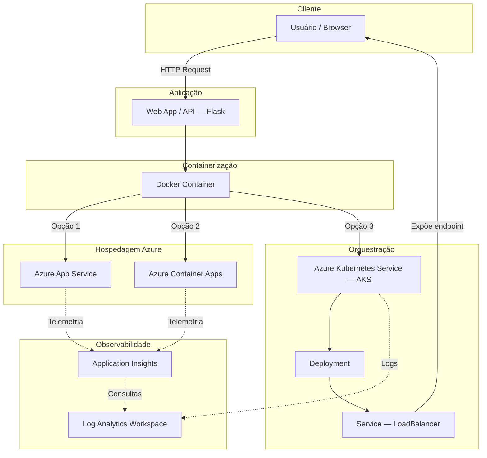

# Arquitetura da Solução

> **Nota:** Este documento descreve a arquitetura **conceitual** do laboratório.
> Os recursos Azure descritos aqui são referências de estudo e **não representam
> infraestrutura provisionada**, salvo quando acompanhados de evidência na pasta `evidence/`.

## Visão Geral

A arquitetura segue um modelo cloud-native com containerização da aplicação,
orquestração via Kubernetes e observabilidade integrada.

## Diagrama Conceitual

## Fluxo de Requisições

1. **Usuário** acessa o endpoint da aplicação via browser ou ferramenta HTTP.
2. **Aplicação Flask** processa a requisição dentro de um container Docker.
3. O container pode ser executado em três cenários de hospedagem:
   - **Azure App Service** — PaaS gerenciado, ideal para aplicações web simples.
   - **Azure Container Apps** — serverless para containers, com auto-scaling.
   - **AKS** — orquestração completa via Kubernetes para cenários complexos.
4. **Observabilidade** é coletada via Application Insights (métricas e traces)
   e Log Analytics (logs centralizados).

## Separação de Responsabilidades

| Camada | Responsabilidade | Tecnologia |
|---|---|---|
| Apresentação | Interface do usuário | Browser / HTTP client |
| Aplicação | Lógica de negócio | Python Flask |
| Containerização | Empacotamento e portabilidade | Docker |
| Orquestração | Gerenciamento de réplicas e scaling | Kubernetes / AKS |
| Plataforma | Hospedagem e runtime | Azure App Service / Container Apps |
| Observabilidade | Monitoramento e diagnóstico | Application Insights + Log Analytics |

## Decisões de Arquitetura

- **Flask** foi escolhido por ser leve, minimalista e adequado para fins didáticos.
- **Docker** permite que a aplicação rode de forma idêntica em qualquer ambiente.
- **Kubernetes manifests** foram criados como exemplos didáticos reproduzíveis.
- A arquitetura é **modular**: cada camada pode ser substituída sem alterar as demais.
