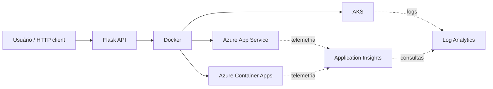

# Arquitetura da Solução

> Este documento descreve a arquitetura **conceitual** do laboratório. Os serviços Azure apresentados são alternativas de hospedagem e observabilidade estudadas; não representam recursos provisionados sem evidência correspondente.

## Visão geral

A aplicação Flask é a carga de trabalho de referência. Ela pode ser executada diretamente, em Docker ou em Kubernetes local. Na Azure, App Service, Container Apps e AKS representam opções distintas de hospedagem, não componentes que precisam coexistir no mesmo deploy.

## Diagrama Mermaid

## Fluxo de requisições

1. O usuário chama a API Flask.
2. A aplicação responde pelos endpoints `/`, `/health` e `/info`.
3. Docker empacota a aplicação e o Gunicorn fornece o servidor WSGI no container.
4. Kubernetes demonstra replicação, Service, health probes, recursos e controles básicos de segurança.
5. Em uma evolução Azure real, uma única opção de hospedagem pode ser escolhida conforme a necessidade.
6. Application Insights e Log Analytics só devem ser apresentados como implementados quando houver telemetria real e evidência correspondente.

## Separação de responsabilidades

| Camada | Responsabilidade | Implementação |
|---|---|---|
| Aplicação | Endpoints e resposta HTTP | Flask |
| Testes | Verificação de comportamento | pytest |
| Runtime | Servir a aplicação no container | Gunicorn |
| Containerização | Empacotamento e portabilidade | Docker |
| Orquestração | Réplicas, exposição e health checks | Kubernetes |
| Plataforma | Hospedagem gerenciada | Azure, opcional |
| Observabilidade | Telemetria, logs e diagnóstico | Application Insights / Log Analytics, conceitual |

## Decisões de arquitetura

- **Flask** mantém o foco do laboratório na plataforma, e não em regras de negócio complexas.
- **Docker** fornece uma unidade reproduzível para CI e para uma futura hospedagem cloud.
- **Kubernetes** é demonstrado com manifests pequenos, sem introduzir Helm ou operadores desnecessários.
- **Azure Container Apps** é a evolução cloud preferencial para uma futura demonstração real por equilibrar simplicidade e aderência ao tema de containers.
- **AKS** permanece como alternativa estudada para cenários que realmente necessitam de Kubernetes gerenciado.
- Métricas, logs e traces estão entre os sinais mais utilizados em estratégias modernas de observabilidade, mas este repositório não declara telemetria Azure real sem evidência.
