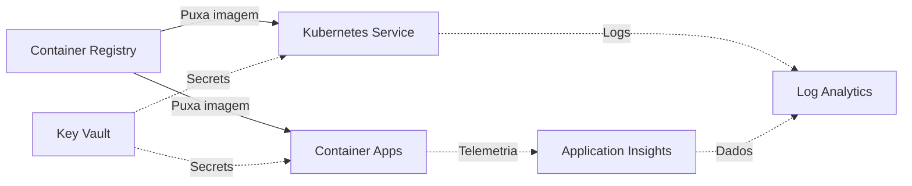

# Serviços Azure — Referência do Laboratório

Tabela de referência dos principais serviços Azure estudados nesta formação.

> **Nota:** Esta tabela é uma referência conceitual. A coluna "Papel no laboratório"
> indica como o serviço se encaixa no contexto deste projeto, não que ele tenha
> sido provisionado.

| Serviço | Função | Quando Usar | Complexidade | Papel no Laboratório |
|---|---|---|---|---|
| **Azure App Service** | Hospedagem de aplicações web e APIs como PaaS | Aplicações web tradicionais, APIs REST, deploy rápido de código | Baixa | Hospedagem direta da aplicação Flask sem necessidade de container |
| **Azure Container Apps** | Execução serverless de containers com auto-scaling | Microserviços containerizados, workloads event-driven, scaling a zero | Média | Alternativa ao App Service quando a aplicação já é um container Docker |
| **Azure Kubernetes Service (AKS)** | Orquestração de containers com Kubernetes gerenciado | Ambientes complexos com múltiplos microserviços, controle granular | Alta | Cenário avançado de orquestração com Deployments e Services |
| **Application Insights** | Monitoramento de performance e telemetria de aplicações | Qualquer aplicação que necessite de métricas, traces e diagnóstico | Baixa–Média | Coleta de telemetria da aplicação: tempo de resposta, erros, dependências |
| **Log Analytics** | Centralização e consulta de logs via KQL (Kusto Query Language) | Ambientes com múltiplos recursos que geram logs | Média | Workspace central para consulta e correlação de logs dos recursos Azure |
| **Azure Container Registry (ACR)** | Registro privado de imagens Docker | Quando imagens Docker precisam ser armazenadas de forma privada e segura | Baixa | Armazenamento da imagem Docker da aplicação (cenário futuro) |
| **Azure Key Vault** | Gerenciamento seguro de secrets, chaves e certificados | Qualquer cenário que exija armazenamento seguro de credenciais | Média | Evolução de segurança para substituir variáveis de ambiente por secrets gerenciados |

## Relação Entre os Serviços

